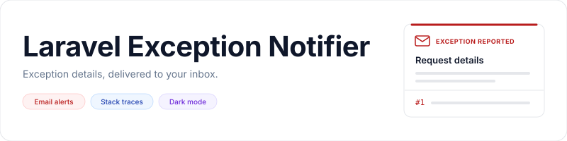

<p align="center">
    <picture>
        <source media="(prefers-color-scheme: dark)" srcset="art/banner-dark.svg">
        <source media="(prefers-color-scheme: light)" srcset="art/banner-light.svg">
        
    </picture>
</p>

<p align="center">Send Laravel exception emails with the message, request URL, IP address, and stack trace.</p>

<p align="center">
    <a href="https://packagist.org/packages/jeremykenedy/laravel-exception-notifier"></a>
    <a href="https://packagist.org/packages/jeremykenedy/laravel-exception-notifier"></a>
    <a href="https://github.com/jeremykenedy/laravel-exception-notifier/actions/workflows/ci.yml"></a>
    <a href="https://github.styleci.io/repos/91833181"></a>
    <a href="LICENSE"></a>
</p>

## Table of Contents

- [Laravel Support](#laravel-support)
- [Requirements](#requirements)
- [Installation](#installation)
- [Quick Start](#quick-start)
- [Laravel 11 through 13](#laravel-11-through-13)
- [Laravel 9 and 10, or an existing Handler class](#laravel-9-and-10-or-an-existing-handler-class)
- [Features](#features)
- [Configuration](#configuration)
- [Changing Email Layouts](#changing-email-layouts)
- [Dark Mode](#dark-mode)
- [Custom Views](#custom-views)
- [Artisan Commands](#artisan-commands)
- [Install and Update Options](#install-and-update-options)
- [Safe Updates](#safe-updates)
- [Testing](#testing)
- [License](#license)

## Laravel Support

The existing standalone Blade email remains the default. `composer update` does not publish files, switch layouts, modify application settings, or register an exception reporting callback. Existing customized mailers and views continue to work.

| Laravel | PHP baseline | Package |
| --- | --- | --- |
| 9 | 8.0.2 | Current release |
| 10 | 8.1 | Current release |
| 11, 12 | 8.2 | Current release |
| 13 | 8.3 | Current release |
| 7, 8 | Determined by your Laravel version | `2.2.0` |
| 5.2 through 6 | Determined by your Laravel version | `1.2.0` |

The current package retains its `^8.0` PHP constraint. Laravel determines the application's minimum PHP version. Historical compatibility testing does not extend Laravel's upstream security support.

See [upgrading](docs/upgrading.md), [historical installation](docs/legacy-installation.md), and [compatibility decisions](docs/compatibility.md).

## Requirements

- PHP and Laravel versions from the table above.
- A configured Laravel mail transport and at least one recipient.

Both email layouts render with self-contained styles. Applications do not need frontend assets or an npm build to send them.

## Installation

```bash
composer require jeremykenedy/laravel-exception-notifier
php artisan exception-notifier:install
```

Laravel discovers the provider automatically. The command detects existing files and preserves them. Choose `keep` to retain the current email or install the legacy view when none exists. An explicit selection offers the legacy or modern layout and a light, dark, or system theme.

For unattended installation using the existing defaults:

```bash
php artisan exception-notifier:install --no-interaction
```

The original publish command remains supported:

```bash
php artisan vendor:publish --tag=laravelexceptionnotifier
```

Both approaches create these files when missing:

- `app/Mail/ExceptionOccurred.php`
- `resources/views/emails/exception.blade.php`
- `config/exceptions.php`

## Quick Start

Configure your application's mail transport, then set the recipients in `.env`:

```dotenv
EMAIL_EXCEPTION_ENABLED=true
EMAIL_EXCEPTION_FROM=errors@example.com
EMAIL_EXCEPTION_TO="developer@example.com,operations@example.com"
EMAIL_EXCEPTION_CC=
EMAIL_EXCEPTION_BCC=
EMAIL_EXCEPTION_SUBJECT="Production exception"
EMAIL_EXCEPTION_THEME=light
```

Register exception reporting using the instructions for your Laravel application below. Installation does not send a test message or register the callback automatically.

### Laravel 11 through 13


Add a report callback to your existing `withExceptions` block in `bootstrap/app.php`:

```php
use App\Mail\ExceptionOccurred;
use Illuminate\Foundation\Configuration\Exceptions;
use Illuminate\Support\Facades\Log;
use Illuminate\Support\Facades\Mail;

->withExceptions(function (Exceptions $exceptions): void {
    $exceptions->report(function (\Throwable $exception): void {
        if (! config('exceptions.emailExceptionEnabled')) {
            return;
        }

        try {
            Mail::send(new ExceptionOccurred([
                'message' => $exception->getMessage(),
                'file' => $exception->getFile(),
                'line' => $exception->getLine(),
                'trace' => $exception->getTrace(),
                'url' => request()->url(),
                'body' => request()->all(),
                'ip' => request()->ip(),
            ]));
        } catch (\Throwable $mailException) {
            Log::error($mailException);
        }
    });
})
```

Laravel's ignored exception rules still apply. The callback does not stop normal logging. Add it once to avoid duplicate emails, and keep any existing reporting callbacks.

### Laravel 9 and 10, or an existing Handler class

In `app/Exceptions/Handler.php`, register the same callback with `$this->reportable(...)` inside `register()`. Keep your existing `dontReport` rules and callbacks. Applications already using `sendEmail()` or `ExceptionNotificationHandlerTrait` can keep them unchanged.

The trait source is available at `src/App/Traits/ExceptionNotificationHandlerTrait.php` for applications that already copy it. It is not automatically loaded into the application's `App` namespace or installed over an existing Handler.

## Features

- Exception messages, request details, and stack traces in email.
- Multiple recipients with optional CC and BCC.
- Original and modern Blade email layouts.
- Light, dark, and system themes.
- Safe installation and layout updates with view backups.
- Custom mailers, views, and existing configuration remain application-owned.

<picture>
    <source media="(prefers-color-scheme: dark)" srcset="docs/images/email-dark.png">
    <source media="(prefers-color-scheme: light)" srcset="docs/images/email-light.png">
    
</picture>

## Configuration

Settings live in `config/exceptions.php`. Existing keys and defaults are preserved.

| Key | Environment variable | Default / purpose |
| --- | --- | --- |
| `emailExceptionEnabled` | `EMAIL_EXCEPTION_ENABLED` | `true`; enables reporting |
| `emailExceptionFrom` | `EMAIL_EXCEPTION_FROM` | Optional sender; otherwise Laravel's configured sender |
| `emailExceptionsTo` | `EMAIL_EXCEPTION_TO` | Comma-separated recipient addresses |
| `emailExceptionCCto` | `EMAIL_EXCEPTION_CC` | Optional comma-separated CC addresses |
| `emailExceptionBCCto` | `EMAIL_EXCEPTION_BCC` | Optional comma-separated BCC addresses |
| `emailExceptionSubject` | `EMAIL_EXCEPTION_SUBJECT` | `Error on ` followed by the application environment |
| `emailExceptionView` | None | `emails.exception` |
| `emailExceptionTheme` | `EMAIL_EXCEPTION_THEME` | `light`; also accepts `dark` or `system` |

## Changing Email Layouts

Run the update command for an interactive layout selection:

```bash
php artisan exception-notifier:update
```

Existing views require `--force` for an explicit replacement. The command saves a unique adjacent `.bak` copy before changing the view. Configuration and mailer files are preserved.

```bash
php artisan exception-notifier:update --layout=modern --theme=system --force
php artisan view:clear
```

To restore the original layout:

```bash
php artisan exception-notifier:update --layout=legacy --theme=light --force
php artisan view:clear
```

| Layout | View | Behavior |
| --- | --- | --- |
| `legacy` | `laravelexceptionnotifier::emails.exception` | Original appearance, mobile wrapping fixes, optional dark mode |
| `modern` | `laravelexceptionnotifier::emails.modern` | Responsive request details and stack trace with inline email styles |

### Dark Mode

`light` stays light, `dark` renders dark colors directly, and `system` follows `prefers-color-scheme` where the email client supports it. Email clients can override colors. Clients without media query support use the light fallback for `system`.

An explicit theme selection is saved in the installed view wrapper. To follow configuration instead, use this in your email view:

```blade
@include('laravelexceptionnotifier::emails.modern')
```

Then set `emailExceptionTheme` in `config/exceptions.php` to `env('EMAIL_EXCEPTION_THEME', 'light')`. Older published config files need this entry added manually.

### Custom Views

`exceptions.emailExceptionView` continues to select the mailable's view. Set it to your own Blade view or `laravelexceptionnotifier::emails.modern`. The `$content` array is unchanged. The commands only manage `resources/views/emails/exception.blade.php`; a custom view setting takes precedence and is never rewritten.

Laravel's standard namespaced overrides under `resources/views/vendor/laravelexceptionnotifier/emails/` also work. Exception values are escaped, and the included templates omit request bodies and stack arguments.

## Artisan Commands

| Command | Description | Flags |
| --- | --- | --- |
| `exception-notifier:install` | Create missing files and optionally select an email layout/theme | `--layout`, `--theme`, `--force`, `--no-interaction` |
| `exception-notifier:update` | Restore missing files or explicitly replace the email view with a backup | `--layout`, `--theme`, `--force`, `--no-interaction` |
| `vendor:publish --tag=laravelexceptionnotifier` | Original Laravel publishing command | Laravel's standard publish options |

### Install and Update Options

| Flag | Values | Description |
| --- | --- | --- |
| `--layout=` | `legacy`, `modern` | Select an email layout |
| `--theme=` | `light`, `dark`, `system` | Select a theme; requires a layout selection |
| `--force` | Flag | Allow replacement of the selected view after a successful backup |
| `--no-interaction` | Flag | Skip prompts; keep existing files when no layout is selected |

## Safe Updates

```bash
composer update jeremykenedy/laravel-exception-notifier
php artisan exception-notifier:update --no-interaction
```

The update command restores missing files and preserves existing files. Even `--force` alone does not reset a view. A replacement requires a layout selection plus `--force`. Configuration and mailer files are never overwritten by these commands.

After changing views or configuration, use your normal deployment cache workflow, for example:

```bash
php artisan view:clear
php artisan config:cache
```

See [the upgrade guide](docs/upgrading.md) for published mailer changes and rollback steps.

## Testing

```bash
composer install
composer test
composer lint
composer audit

npm ci --ignore-scripts
npx playwright install chromium
npm run test:browser
```

PHPUnit covers publishing, configuration, recipients, rendering and in-memory mail delivery, throwable reporting, delivery failures, escaping, themes, and command upgrades. Browser tests cover mobile and desktop rendering, long text, system theme changes, and accessibility of the modern layout. Tests use generated sample data and do not send external mail.

CI tests Laravel 9 through 13 on their supported PHP combinations, plus the lowest dependencies on PHP 8.0 and a pinned Laravel 9.20 mail-delivery regression. Browser tests, lint, audits, and a coverage report run on the current stack. Node and npm are development tools for browser testing only. See [testing details](docs/testing.md).

## License

This package is open-sourced software licensed under the [MIT license](LICENSE).
