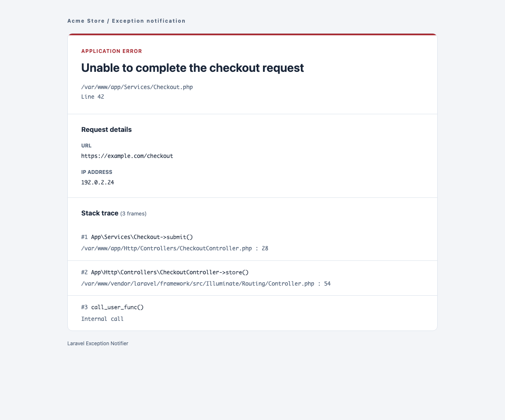

# Laravel Exception Notifier

Send Laravel exception emails with the message, request URL, IP address, and stack trace.

[](https://github.com/jeremykenedy/laravel-exception-notifier/actions/workflows/ci.yml)
[](https://packagist.org/packages/jeremykenedy/laravel-exception-notifier)
[](https://packagist.org/packages/jeremykenedy/laravel-exception-notifier)
[](LICENSE)

<picture>
  <source media="(prefers-color-scheme: dark)" srcset="docs/images/email-dark.png">
  <source media="(prefers-color-scheme: light)" srcset="docs/images/email-light.png">
  
</picture>

## Compatibility

The existing standalone Blade email remains the default. `composer update` does not publish files, switch layouts, modify application settings, or register an exception reporting callback. Existing customized mailers and views continue to work.

| Laravel | PHP baseline | Package |
| --- | --- | --- |
| 9 | 8.0.2 | Current release |
| 10 | 8.1 | Current release |
| 11, 12 | 8.2 | Current release |
| 13 | 8.3 | Current release |
| 7, 8 | Determined by your Laravel version | `2.2.0` |
| 5.2 through 6 | Determined by your Laravel version | `1.2.0` |

The current package retains its `^8.0` PHP constraint. Laravel determines the application's minimum PHP version. Historical compatibility testing does not extend Laravel's upstream security support.

See [upgrading](docs/upgrading.md), [historical installation](docs/legacy-installation.md), and [compatibility decisions](docs/compatibility.md).

## Install

```bash
composer require jeremykenedy/laravel-exception-notifier
php artisan exception-notifier:install
```

Laravel discovers the provider automatically. The command offers the existing layout, Bootstrap 5, or Tailwind, followed by light, dark, or system theme. Choosing `keep` preserves the current view or installs the legacy view if none exists.

For unattended installation using the existing defaults:

```bash
php artisan exception-notifier:install --no-interaction
```

The original publish command remains supported:

```bash
php artisan vendor:publish --tag=laravelexceptionnotifier
```

Both approaches create these files when missing:

- `app/Mail/ExceptionOccurred.php`
- `resources/views/emails/exception.blade.php`
- `config/exceptions.php`

Configure your application's mail transport, then set the notification recipients:

```dotenv
EMAIL_EXCEPTION_ENABLED=true
EMAIL_EXCEPTION_FROM=errors@example.com
EMAIL_EXCEPTION_TO="developer@example.com,operations@example.com"
EMAIL_EXCEPTION_CC=
EMAIL_EXCEPTION_BCC=
EMAIL_EXCEPTION_SUBJECT="Production exception"
EMAIL_EXCEPTION_THEME=light
```

If no subject is supplied, the default is `Error on ` followed by the application environment. The package does not send a test message during installation.

## Register exception reporting

### Laravel 11 through 13

Add a report callback to your existing `withExceptions` block in `bootstrap/app.php`:

```php
use App\Mail\ExceptionOccurred;
use Illuminate\Foundation\Configuration\Exceptions;
use Illuminate\Support\Facades\Log;
use Illuminate\Support\Facades\Mail;

// In the existing application builder chain:
->withExceptions(function (Exceptions $exceptions): void {
    $exceptions->report(function (\Throwable $exception): void {
        if (! config('exceptions.emailExceptionEnabled')) {
            return;
        }

        try {
            Mail::send(new ExceptionOccurred([
                'message' => $exception->getMessage(),
                'file' => $exception->getFile(),
                'line' => $exception->getLine(),
                'trace' => $exception->getTrace(),
                'url' => request()->url(),
                'ip' => request()->ip(),
            ]));
        } catch (\Throwable $mailException) {
            Log::error($mailException);
        }
    });
})
```

Laravel's ignored exception rules still apply. The callback does not stop normal logging. Add it once to avoid duplicate emails, and keep any existing reporting callbacks.

### Laravel 9 and 10, or an existing Handler class

In `app/Exceptions/Handler.php`, register the same callback with `$this->reportable(...)` inside `register()`. Keep your existing `dontReport` rules and callbacks. Applications already using `sendEmail()` or `ExceptionNotificationHandlerTrait` can keep them unchanged.

The trait source is available at `src/App/Traits/ExceptionNotificationHandlerTrait.php` for applications that already copy it. It is not automatically loaded into the application's `App` namespace or installed over an existing Handler.

## Layouts and dark mode

| Option | View | Behavior |
| --- | --- | --- |
| `legacy` | Original standalone Blade template | Default layout, with mobile wrapping fixes and optional dark mode |
| `bootstrap5` | Blade with Bootstrap 5 classes | Modern email layout with inline styles |
| `tailwind` | Blade with Tailwind utility classes | Same email content and layout with inline styles |

All three render without npm, a CDN, JavaScript, or external fonts. The optional layouts use a shared template so their content and escaping stay consistent. They are email templates, not an admin dashboard or frontend scaffold. Browser framework classes are included for customization; the email appearance does not require a full framework stylesheet.

```bash
# Select a layout during installation.
php artisan exception-notifier:install --framework=bootstrap5 --theme=system

# Explicitly replace an existing view, saving a backup first.
php artisan exception-notifier:update --framework=tailwind --theme=dark --force

# Return to the original layout.
php artisan exception-notifier:update --framework=legacy --theme=light --force
```

`light` stays light, `dark` renders dark colors directly, and `system` follows `prefers-color-scheme` where the email client supports it. Email clients can override colors, and clients without media query support use the light fallback for `system`.

A selected theme is saved in the generated view wrapper. For a view that follows configuration instead, use:

```blade
@include('laravelexceptionnotifier::emails.tailwind')
```

Then set `emailExceptionTheme` in `config/exceptions.php` to `env('EMAIL_EXCEPTION_THEME', 'light')`. Older published config files need this entry added manually.

### Custom views

`exceptions.emailExceptionView` continues to select the mailable's view. Set it to your own Blade view or a package view such as `laravelexceptionnotifier::emails.bootstrap5`. The `$content` array is unchanged. The commands only manage `resources/views/emails/exception.blade.php`; a custom view setting takes precedence and is never rewritten.

Laravel's standard namespaced overrides under `resources/views/vendor/laravelexceptionnotifier/emails/` also work.

### Optional Laravel UI Kit

If your application already uses [Laravel UI Kit](https://github.com/jeremykenedy/laravel-ui-kit), the commands can read its configured CSS framework and default theme:

```bash
php artisan exception-notifier:install --ui-kit
php artisan exception-notifier:update --ui-kit --force
```

This selects `bootstrap5` or `tailwind` using `ui-kit.css_framework` and reads `ui-kit.dark_mode.enabled` and `ui-kit.dark_mode.default`. `--theme` can override the imported theme. An absent configuration or unsupported framework fails before writing files. Do not combine `--ui-kit` and `--framework`.

The selection is copied when the command runs. Later UI Kit changes do not silently switch your emails. UI Kit is optional, has its own Laravel/PHP requirements, and is neither installed nor modified by these commands. Email views do not use its interactive components.

[Laravel Toast](https://github.com/jeremykenedy/laravel-toast), [Laravel Darkmode Toggle](https://github.com/jeremykenedy/laravel-darkmode-toggle), [Laravel IP Capture](https://github.com/jeremykenedy/laravel-ip-capture), and [Laravel Seedster](https://github.com/jeremykenedy/laravel-seedster) are not required. This package has no browser interactions or database records that need those integrations. The request IP comes from Laravel's request object.

## Safe updates

```bash
composer update jeremykenedy/laravel-exception-notifier
php artisan exception-notifier:update --no-interaction
```

The update command restores missing files and preserves existing files. Even `--force` alone does not reset a view. A replacement requires `--framework` or `--ui-kit` plus `--force`; the previous view is saved beside it with a unique `.bak` suffix. Configuration and mailer files are never overwritten by these commands.

After changing views or configuration, use your normal deployment cache workflow, for example:

```bash
php artisan view:clear
php artisan config:cache
```

See [the upgrade guide](docs/upgrading.md) for published mailer changes and rollback steps.

## Testing

```bash
composer install
composer test
composer lint
composer audit

npm ci --ignore-scripts
npx playwright install chromium
npm run test:browser
```

PHPUnit covers publishing, configuration, recipients, actual rendering and in-memory mail delivery, throwable reporting, delivery failures, escaping, themes, and command upgrades. Browser tests cover mobile and desktop rendering, long text, system theme changes, and accessibility of the modern layouts. Tests use generated sample data and do not send external mail.

CI tests Laravel 9 through 13 on their supported PHP combinations, plus the lowest dependencies on PHP 8.0. Browser tests, lint, audits, and a coverage report run on the current stack. See [testing details](docs/testing.md).

## License

Copyright (c) 2017-2026 Jeremy Kenedy. Released under the [MIT license](LICENSE).
